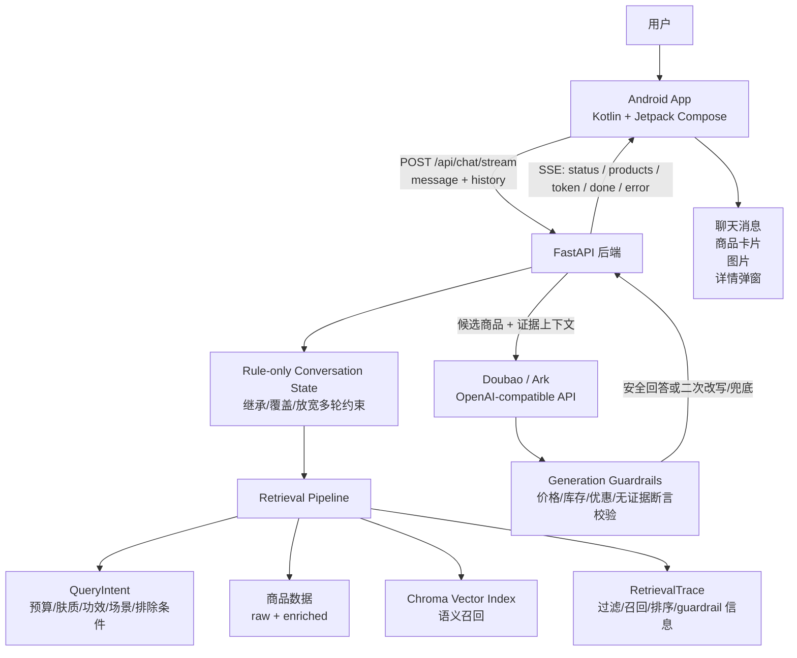
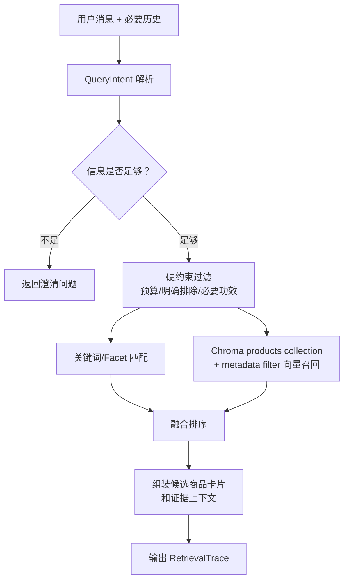

# 系统架构说明

日期：2026-05-28

更新：2026-06-03 补充 rule-only conversation state merge。

用途：说明当前 RAG 美妆导购 Agent 的端到端工程架构，方便评审、复盘和后续开发对齐。

## 一句话架构

当前系统是一条原生移动端到后端 RAG 的闭环：

> Android Kotlin 原生 App 负责对话、流式渲染、商品卡片和详情展示；FastAPI 后端负责意图解析、商品检索、Doubao 调用、生成后校验和 SSE 返回；数据层保留官方 raw 数据，并通过 enriched 商品字段支撑可解释推荐。

## 总体链路

## 模块职责

### Android 客户端

路径：`client/android/`

当前职责：

1. 提供原生 Android 聊天界面。
2. 通过 OkHttp 调用后端 `POST /api/chat/stream`。
3. 消费 SSE 事件：
   - `status`：展示检索/生成状态。
   - `products`：渲染商品卡片。
   - `token`：逐步追加助手回复。
   - `done`：结束 loading。
   - `error`：展示可理解错误。
4. 加载商品图片：使用后端 `/assets/{image_path}`。
5. 点击商品卡片打开详情弹窗，展示来自数据源的结构化字段。
6. 提供 9 个演示快捷问题，降低中文输入和现场演示的不确定性，并覆盖新增美妆子类。
7. 多轮对话后自动滚动到最新回复，保证录屏和演示可见。

关键文件：

- `MainActivity.kt`：Compose UI、消息列表、商品卡片、详情弹窗、快捷问题。
- `ChatViewModel.kt`：维护输入、消息、loading 状态和发送逻辑。
- `ShoppingAgentClient.kt`：封装 SSE 请求、事件解析、商品卡片解析。
- `Models.kt`：Android 端消息和商品卡片数据结构。

### FastAPI 后端

路径：`server/app/`

当前职责：

1. 启动 FastAPI 服务。
2. 加载 raw 商品数据和 enriched 美妆数据。
3. 暴露核心接口：
   - `GET /health`
   - `POST /api/chat/stream`
   - `POST /api/debug/retrieve`
   - `GET /assets/{image_path}`
4. 在检索前做 rule-only conversation state merge，例如预算更新、预算取消、排除条件继承和短追问补全。
5. 调用检索层得到候选商品、证据文本和 trace。
6. 调用 Doubao / Ark 生成导购回答。
7. 对模型输出做 guardrail 校验，必要时二次改写或安全兜底。
8. 用稳定 SSE 形态返回给 Android，避免客户端因为模型失败直接卡死。

关键文件：

- `main.py`：API 路由、SSE 事件、上下文合并、静态图片服务。
- `conversation_state.py`：检索前的多轮状态合并，负责继承/覆盖/放宽预算、类目、肤质、功效、场景、排除条件和偏好。
- `config.py`：读取 `.env` 和本地路径配置。
- `data_loader.py`：加载 raw / enriched 商品数据。
- `models.py`：Pydantic 数据结构。
- `llm.py`：Doubao 调用、二次改写、mock / safe fallback。
- `guardrails.py`：生成后校验和安全回答生成。
- `retrieval.py`：意图解析、硬过滤、多路召回、排序和 trace。
- `embeddings.py`：sentence-transformer embedding。

## 数据层

当前数据分三层：

| 层级 | 路径 | 是否提交 | 用途 |
| --- | --- | --- | --- |
| 官方原始数据 | `data/raw/ecommerce_agent_dataset/` | 提交 | 商品 JSON、图片、RAG 文本素材 |
| 增强商品数据 | `data/enriched/*_products.jsonl` | 提交 | 肤质、功效、材质、尺码、使用场景、注意事项、推荐理由、证据来源等结构化字段 |
| 本地索引产物 | `data/indexes/` | 不提交 | Chroma 持久化向量库 |

设计原则：

1. raw 数据不直接修改，保证可回溯。
2. enriched 数据承担导购语义和结构化展示。
3. 商品卡片和详情字段只能来自 raw / enriched，不由模型自由生成。
4. 索引属于可再生本地产物，不进入 Git。

## RAG 检索链路

当前 V1 检索不是纯向量 RAG，而是轻量混合检索。

`QueryIntent` 当前覆盖：

- `category_candidates`
- `universal_constraints.budget_max`
- `facets.skin_type`
- `facets.effect`
- `facets.use_case`
- `hard_constraints`
- `soft_preferences`
- `exclude_terms`
- `needs_clarification`
- `confidence`

当前已实现的可靠性策略：

1. 明确预算直接硬过滤，不用模型猜。
2. 泛泛说“我想买护肤品”时先追问，不直接推荐。
3. “不要酒精/刺激”等排除条件进入检索和生成层约束。
4. 用户明确提出防晒、修护、定妆、淡斑等功效时，预算内但完全不匹配功效的商品不会靠低价乱入。
5. Chroma 作为语义召回通道，但不替代结构化约束。
6. `/api/debug/retrieve` 可查看 `RetrievalTrace`，用于解释为什么推荐这些商品。

## 生成与反幻觉

Doubao 生成层遵循 evidence-bound 设计：

1. 模型只看到最终候选商品和证据文本。
2. Prompt 明确禁止编造价格、库存、优惠、购买链接和数据源外功效。
3. 后端先收集完整模型回答，再做 guardrail 校验。
4. 如果校验失败：
   - 有真实模型和候选商品时，先尝试二次改写。
   - 二次改写仍失败或模型不可用时，返回基于商品卡片的安全兜底回答。

当前 guardrail 覆盖：

- 未授权价格。
- 库存、优惠、下单承诺。
- 空回答。
- 无证据的“不含/不会刺激/无酒精”等绝对断言。

这个设计的核心取舍是：

> 为了保证 Android 端稳定和回答可信，后端不直接把模型原始 token 原样透传给客户端，而是先聚合、校验，再以 SSE token 形式重新流式输出。

## API 与事件契约

主接口：`POST /api/chat/stream`

请求包含：

- `message`：本轮用户输入。
- `conversation_id`：本地 demo 标识。
- `history`：最近用户和助手消息，用于多轮上下文；assistant 消息可携带上一轮商品卡片 `product_ids`。

SSE 事件：

| 事件 | 作用 |
| --- | --- |
| `status` | 告诉客户端正在检索或生成 |
| `products` | 返回本轮商品卡片数组 |
| `token` | 返回回答文本片段 |
| `done` | 本轮结束 |
| `error` | 可恢复错误 |

图片接口：`GET /assets/{image_path}`

- 只暴露官方数据集图片目录。
- `image_path` 来自商品卡片字段。
- Android 端负责 URL 编码中文目录。

调试接口：`POST /api/debug/retrieve`

- 不调用大模型。
- 返回候选商品、澄清问题和 `RetrievalTrace`。
- 用于 benchmark、失败 case 排查和答辩解释。

## 当前验证状态

已经完成：

1. 后端脚本级验证：
   - 8 条 golden queries。
   - 6 条多轮 conversation cases。
   - 真实 Doubao 三轮 probe。
   - 生成层 guardrail。
2. Android 模拟器验证：
   - 首页、快捷问题、真实回复。
   - 商品卡片、图片、价格、标签。
   - 商品详情弹窗。
   - 信息不足主动追问。
   - 连续多轮自动滚动。
3. 本地录屏：
   - `demo/录屏v1.mov`
   - 录屏文件为本地生成媒体，已被 `.gitignore` 忽略，不进入 Git。

## 当前边界

1. 主线仍是美妆文字导购，不包含图片输入、语音、购物车或下单。
2. enriched 数据已覆盖完整 25 条美妆商品和 5 条服饰运动样例，但当前 Android 演示主线仍以美妆垂类为主。
3. Guardrail 是规则版，不是完整 groundedness judge。
4. Chroma 当前作为轻量向量召回通道，已使用统一 `products` collection 和 metadata filter；还没有做 embedding 模型对比 benchmark。
5. Graph-aware retrieval、多商品对比和反馈闭环还没有进入主链路。

## 后续演进

### V1 收口

1. 用 25 条美妆数据抽样复验 Android 端展示和推荐稳定性。
2. 把更多真实模型 failure cases 沉淀到 guardrail / benchmark。
3. 补一个轻量多商品对比能力，增强导购“决策辅助”感。
4. 继续同步 README、评测记录和提交材料。

### V2 增强

1. 轻量商品属性图：
   - product -> brand
   - product -> category / sub_category
   - product -> skin_type / effect / use_case
   - product -> caution / avoid_for
2. Graph-aware ranking：
   - 解释商品和用户需求之间的属性匹配关系。
   - 为多商品对比提供结构化依据。
3. 反馈闭环：
   - 记录用户是否觉得推荐有用。
   - 保存失败 query。
   - 反哺数据增强、prompt 和 guardrail。
