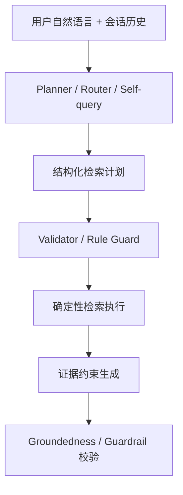

# Agentic RAG / LLM Planner 调研补充

日期：2026-05-31

用途：记录为什么我们从“规则解析 + hybrid retrieval”进一步调研 `LLM Planner / Agentic RAG`，调研到了哪些主流/经典脉络，以及这些结果如何辅助本项目后续设计。

## 触发问题

当前项目已经完成第一版约束感知 RAG：

```text
用户 query -> 规则 QueryIntent -> 硬过滤 -> keyword/facet/vector/graph 排序 -> 证据约束生成 -> guardrail
```

这条链路适合处理明确条件：

- 预算：200 元以内、预算降到 150。
- 类目：防晒、面霜、卸妆、T 恤。
- 排除：不要酒精、不要刺激、不要库存/优惠/下单承诺。
- 明确信息不足：我想买护肤品。

但 groundedness benchmark 暴露了一个更真实的问题：多轮用户表达不总是显式、完整、规则友好。

典型失败形态：

```text
第一轮：我是油皮，想要 200 元以内通勤防晒，不要酒精味太重。
第二轮：预算可以放宽到 300。
第三轮：那它有没有酒精？
第四轮：有没有更像刚才那个但便宜一点的？
```

这里需要系统同时理解：

1. “预算放宽到 300”是更新预算，不是取消预算。
2. “它”指向上一轮推荐或用户正在讨论的商品。
3. “更像刚才那个”要求继承商品属性，而不是重新开始搜索。
4. “不要酒精味太重”是排除/风险偏好，后续不能悄悄丢掉。

因此我们开始调研：是否应该在检索前引入 `LLM Planner`，让模型参与“检索意图构造”，而不是只在最后生成答案。

## 调研结论

最新趋势不是让 LLM 直接替代检索，而是让 LLM 参与生成可执行、可校验的检索计划。

可以概括为：



对本项目最重要的启发：

> LLM Planner 应该是“辅助理解层”，不是“自由裁判”。它可以帮助把口语、多轮、代词和隐含偏好翻译成结构化计划；但计划必须被 schema、规则和商品证据校验。

## 最新工作脉络

| 工作 / 框架 | 核心思想 | 对本项目的启发 | 是否直接采用 |
| --- | --- | --- | --- |
| AgenticRAG (2026) | 在企业知识库上给 LLM search/find/open/summarize 等工具，让模型迭代检索和分析证据 | RAG 不一定是一轮 top-k；可以让系统在证据不足时继续找、重查或细读 | 不直接接入；借鉴“工具式检索 + 证据导航” |
| Rethinking Agentic RAG (2026) | 让 LLM 生成 logical retrieval intent，由轻量检索接口严格执行 | 很贴合电商：自然语言最终应落到 price/category/exclude/product_id 等逻辑条件 | 不直接接入；作为 Planner 设计的主要理论依据 |
| A-RAG (2026) | 给模型 keyword_search、semantic_search、chunk_read 三类层级检索工具 | 可类比成 product_filter、semantic_product_search、product_detail_read | 不直接接入；参考其工具粒度和 agent loop |
| LangGraph Agentic RAG | 用 graph state + tool call + relevance grader + rewrite loop 管理检索流程 | 证明“检索、判断、改写、再检索”可以拆成可观察节点 | 不引入重框架；借鉴节点化与状态化 |
| LlamaIndex Agentic Strategies / Router | 用 routing、query transformation、query engine tools 做检索决策 | 适合多品类、多检索源：美妆/服饰/对比/详情事实问答可作为不同工具 | 暂不引入；借鉴 router / pydantic selector 思路 |
| LangChain SelfQueryRetriever | LLM 先生成 structured query / metadata filter，再交给 vector store | 正好对应“规则抽不全时让 LLM 补结构化 filter” | 不直接用；自研轻量 self-query 更可控 |
| Agentic RAG for Fintech (2025) | 用 query reformulator、sub-query generator、reranker、QA agent 处理专业领域缩写和碎片信息 | 和电商相似：领域字段多、术语多、需要专门 query reformulation 和评测集 | 不直接用；借鉴 modular agent + human-verified benchmark |

## 经典/高频前序工作

这些工作在多篇新论文和工程框架里反复出现，构成了这次调研的背景脉络。

| 方向 | 代表工作 | 经典原因 | 对本项目的保留方式 |
| --- | --- | --- | --- |
| 原始 RAG | Retrieval-Augmented Generation (2020) | 奠定“外部检索 + 生成”的基本范式 | 仍保留：商品库证据进入 prompt |
| Self-query / metadata filtering | LangChain SelfQueryRetriever 等 | 让 LLM 把自然语言转成结构化 filter | 作为 Planner 的直接参考：输出 JSON plan，而不是自然语言 |
| Query rewriting / query transformation | Multi-query、query rewrite、sub-question query engine | 解决用户问法短、跳跃、上下文缺失 | 用于多轮短追问：“它呢”“便宜点”“换一个” |
| Corrective RAG (CRAG) | 检索质量评估，不够好时纠正/重检索 | 认为很多幻觉其实是检索失败导致 | 后续可做 retrieval evaluator，而不是只靠生成 guardrail |
| Self-RAG | 模型学习何时检索、何时 critique | 把 retrieve/generate/critique 拆开 | 不训练模型；借鉴“生成前后都要自检”的流程 |
| GraphRAG / LightRAG | 用实体关系图增强检索 | 商品-品牌-类目-功效-风险天然适合图结构 | 已用轻量 graph relation score，不接重图数据库 |
| Router / Tool-use Agent | LlamaIndex Router、LangGraph tools | 让模型选择检索工具和路径 | 后续可把“商品搜索/商品详情/对比/追问”做成工具选择 |
| LLM-as-judge / synthetic eval | 多篇 domain RAG 论文使用 | 真实标注难时，用模型生成候选，再人工校验 | 已做 groundedness benchmark；后续可加入小规模 LLM judge |

## Rule-only 的前序依据

这里说的 `rule-only` 不是某一篇 RAG 论文里的完整算法名，而是把几个成熟工程模块先组合成低风险基线：

1. **电商 faceted search**：价格、品牌、类目、子类、尺码、材质等字段长期用确定性过滤处理。
2. **Self-query / metadata filtering**：LLM 或 parser 把自然语言变成结构化 filter，真正执行时仍交给数据库或向量库 metadata filter。
3. **Query parsing / query rewriting**：把“预算降到150”“先不看预算”“不要酒精刺激”转成机器可执行约束。
4. **Guardrail / validator**：预算、商品事实、排除条件这类不能错的边界，用规则做最后校验。
5. **Conversation state**：多轮系统里常见的状态合并规则，例如最新明确值覆盖旧值、没有显式取消时继承用户硬约束。

可以直接借鉴的不是具体词表，而是规则类型：

| 规则类型 | 可借鉴做法 | 本项目改造 |
| --- | --- | --- |
| 数值范围 | `price <= budget_max` 作为硬过滤 | `200元以内`、`预算降到150`、`放宽到300` |
| 类目/子类 | category / subcategory facet filter | 美妆护肤、服饰运动、防晒、眼霜、T恤、跑步鞋 |
| 排除条件 | deny-list / risk-term filter | 酒精、刺激、太油、拔干等，且后续默认继承 |
| 信息不足 | 不满足最低信息量时先追问 | “我想买护肤品”先问肤质/预算/功效 |
| 状态合并 | 最新明确约束覆盖旧约束 | 新预算覆盖旧预算；“先不看预算”才取消预算 |
| 输出校验 | 生成后检查是否越界 | 不编造价格、库存、优惠、下单承诺和无证据断言 |

必须本地改造的部分：

- 中文口语表达：例如“预算可以放宽到300”和“先放宽预算”语义不同，不能只看“放宽”两个字。
- 美妆领域风险：酒精、刺激、敏感肌、屏障不稳定等不是普通关键词，和商品证据绑定很紧。
- 小数据集边界：官方商品池只有有限商品，系统要能明确说“没有同时满足条件的商品”。
- 比赛可解释性：trace 要能说清楚哪些条件被继承、覆盖、取消，而不是只输出最终推荐。

因此，本项目采用的策略是：

```text
rule-only 负责不能错的显式边界
always-light planner 每轮补一份结构化检索计划
validator 始终保留最后否决权
```

## 产业侧 / 产品侧公开信号

日期：2026-06-05

这一节补充公开可查的产业侧信息。需要注意：大型平台通常不会完整披露购物 Agent 的内部架构，因此下面分成两类：

- **公开确认**：平台或论文明确说明的数据源、模块或流程。
- **工程推断**：从公开描述中可以较稳妥推断出的架构倾向，但不是官方完整设计图。

### 1. Amazon Rufus：实时路由 + 多模型 + 商品知识图谱 + RAG

Amazon 对 Rufus 的公开描述里，几个信号非常明确：

- Rufus 是 generative / agentic AI shopping assistant。
- 数据源包括 Amazon 商品目录、用户评论、社区 Q&A、外部 Web 信息。
- 使用 Amazon Bedrock 上的多模型组合，包括 Claude Sonnet、Amazon Nova 和基于 Amazon store knowledge 的自定义模型。
- 使用 real-time router 根据 query type 做模型选择，以平衡能力、延迟和回答质量。
- 持续扩展 product attributes 和 customer preferences 的 knowledge graph。
- 使用 RAG 从外部可信来源抽取趋势和商品相关信息。

对本项目的启发：

1. **大平台不是纯规则，也不是纯 LLM**。Rufus 更像是 `router + multiple models + catalog / review / Q&A / web RAG + knowledge graph` 的组合。
2. **router 是公开出现的关键词**。这说明“每个 query 先走一个调度/路由层”在产业系统里是合理的，而不是只在规则失败时才补救。
3. **知识图谱和用户偏好图谱是购物场景核心资产**。我们的轻量 graph relation score 和用户约束 state 可以作为小数据集版本的对应实现。
4. **实时性和延迟是产品约束**。不能简单“每轮都多次 LLM planning + 多次检索 + 多次生成”，否则 Android 端体验会变慢。

### 2. Taobao LEAPS：非侵入式 LLM 插件，Broaden-and-Refine

Taobao AI Search 的 LEAPS 论文非常贴近我们现在的问题。公开摘要里说，用户搜索行为从离散关键词转向自然语言、多约束 query，传统电商搜索架构难以处理。LEAPS 不是替换原搜索系统，而是在传统搜索 pipeline 两端接插件：

- **Upstream Query Expander**：生成自适应、互补的 query combinations，尽量扩大候选集，避免自然语言太精确导致 zero-result。
- **Downstream Relevance Verifier**：综合 OCR、评论等多源信号，用 reasoning 过滤噪声。
- 其非侵入式架构保留已有短文本检索性能，同时低成本接入不同后端。

对本项目的启发：

1. **不是 rule parser 低置信度才调用 LLM 的单点补丁**。LEAPS 更像是在检索前后都接 LLM 增强：前面扩 query，后面验 relevance。
2. **保留原检索系统是产业常见做法**。这和我们不想重接 LangGraph / LlamaIndex 主框架一致。
3. **自然语言多约束 query 会导致 zero-result / noisy generic results**。这正好对应我们现在的“预算 150 没识别”和“油皮+户外没有真正收窄”的体验问题。
4. **轻量 Planner 可以拆成两块**：
   - `Planner / Expander`：把口语、多轮、数字、隐含约束翻译成结构化计划或补全 query。
   - `Verifier`：检查候选商品是否真的满足用户约束，不满足时生成追问或放宽建议。

### 3. Walmart Semantic Retrieval：传统倒排 + embedding retrieval 的混合召回

Walmart 的 semantic retrieval 论文强调：在 product search 里，rerank 之前的 candidate retrieval 比普通 Web search 更关键，尤其是 tail queries，因为这类 query 往往有复杂、具体的 intent。它们部署的是传统 inverted index 和 embedding-based neural retrieval 的混合系统。

对本项目的启发：

1. **大规模电商检索仍保留传统检索骨架**，不是把商品搜索完全交给 LLM。
2. **tail query / complex intent 是核心问题**。我们的 benchmark 应该更多覆盖长自然语言、多约束、口语预算、否定条件和多轮收窄。
3. **Planner 不应该替代 retrieval**。它更适合作为 query rewriting / structured filter 构造层，把复杂 intent 交给确定性检索系统执行。

### 4. Google Shopping Graph：结构化商品数据是 AI 购物体验的底座

Google Shopping Help 明确说明 Shopping Graph 是动态商品信息库，包含商品名、描述、价格、图片、评论等信息；这些数据来自 Merchant Center、Manufacturer Center 等商家数据源，并用于 Search、Ads、YouTube 和生成式 AI 功能，包括 review summaries、buying guidance、product recommendations。

对本项目的启发：

1. **AI shopping 的基础不是 prompt，而是商品数据图谱/结构化 feed**。
2. **价格、图片、评论、商品描述都应来自数据源**。这支持我们现在“商品卡字段不由模型生成”的设计。
3. **生成式 AI 功能可以在结构化商品图谱上运行**。我们的 `data/enriched`、metadata、graph relation、retrieval trace 是小规模比赛版本的 Shopping Graph。

### 5. OpenAI / Stripe Agentic Commerce Protocol：发现和购买分层

OpenAI 的 Instant Checkout / Agentic Commerce Protocol 公开说明里，有两个层次值得拆开：

- **Product discovery**：用户问购物问题时，ChatGPT 展示相关商品；产品结果按 relevance 排序，且 Instant Checkout 不影响排序。
- **Transaction / checkout**：如果商品支持 Instant Checkout，用户确认后，订单、支付、履约由商家系统处理；ChatGPT 作为用户 AI agent 在用户和商家之间传递必要信息。

Stripe 也说明，ChatGPT 用户先在 chat 里获得推荐，准备购买时才进入 inline checkout；订单通过 ACP 流向商家后端。

对本项目的启发：

1. **发现 / 决策辅助 / 下单是分层的**。我们第一阶段只做 discovery + decision support，不做 checkout，是合理边界。
2. **交易动作必须有用户确认和商家后端校验**。这支持我们不让模型承诺库存、优惠、下单结果。
3. **商品 feed / structured product data 是 agentic commerce 的前置条件**。后续如果做提交材料，可以强调本项目先实现“可解释商品发现层”。

### 6. 行业工程文章的共识：Catalog Graph + Hybrid Retrieval + Grounded Generation + Evaluation

一些电商 AI 工程文章虽然不是大平台内部论文，但它们反复出现类似架构：

```text
catalog / product graph
-> hybrid retrieval
-> grounded structured generation
-> conversion / feedback / eval
```

Redis 的 AI shopping assistant 文章把购物助手分成 semantic search、RAG assistant、agentic system 等类型，并强调生产问题集中在：

- 商品规格、价格、库存幻觉。
- live catalog freshness。
- 多步骤 pipeline latency。
- session memory 和长期用户偏好。

Alhena 的 hybrid RAG 文章则强调向量搜索和 knowledge graph 各有盲点：向量适合自然语言模糊匹配，graph 适合实体、变体、政策、兼容性等结构化关系；它们采用 vector leg + graph leg + fusion，再交给 agent 使用。

对本项目的启发：

1. **“每轮都 LLM Planner”不一定是产业唯一做法**。更常见的是 router / retrieval / graph / generator / verifier 多层混合。
2. **低延迟场景下，planner 调用应该被预算化**：可以默认只做一次轻量 structured planning，而不是多轮 agent loop。
3. **重要的不是 LLM 是否每轮都参与，而是每轮是否有可解释 retrieval plan**。这个 plan 可以由规则、LLM 或二者融合得到。

## 开源框架可借鉴部分

这轮调研里，真正值得借鉴的不是直接接入某个框架，而是把它们拆成几个小的工程思想：

| 框架 / 模块 | 可借鉴点 | 本项目采用方式 |
| --- | --- | --- |
| LangChain SelfQueryRetriever | LLM 先把自然语言拆成 semantic query + metadata filter，再交给 vector store 执行 | 借鉴 structured query 思路，让 Planner 输出 JSON `RetrievalPlan`，而不是直接改写自然语言 |
| LlamaIndex Router / Selector | 通过 selector 在多个 query engine / retriever 之间选择路径 | 借鉴“先判断 turn type / route”的概念，但第一版不引入运行时框架 |
| LangGraph Agentic RAG | 用节点和 conditional edges 拆出 retrieve、grade、rewrite、generate 等阶段 | 借鉴 trace 思路，把 Planner 调用、校验、fallback 记录到 `planner_trace` |
| Haystack ConditionalRouter | 用显式条件把 pipeline 分到不同分支 | 借鉴规则路由和 fallback 思路，用本地 validator 保证 Planner 不能越过硬约束 |
| OpenAI Structured Outputs / function calling 类模式 | 用 schema 限定模型输出，降低自由文本不稳定性 | Doubao 侧先用 prompt + JSON parse + Pydantic 校验模拟；不依赖特定 OpenAI 运行时 |

因此这里的结论是：**框架给我们结构，但不接管系统**。电商导购里的预算、排除条件、商品事实和价格都必须由本地 schema / 商品数据 / guardrail 兜住；Planner 只能帮系统写一份可执行、可校验的检索计划。

## 对“rule parser -> 低置信度才 LLM Planner”的重新审视

这轮产业侧和开源框架调研使我们需要重新审视原来的短期路线。

原路线：

```text
rule parser
-> 如果低置信度，再 LLM planner
-> validator
-> retrieval
```

这个路线优点是成本低、延迟低、可解释；缺点是用户体验依赖规则覆盖度，容易出现“我的预算可能只有150”这种口语表达漏识别。

结合 Rufus / LEAPS / Walmart / Google Shopping Graph 的公开信号，更合理的候选路线有三种：

| 路线 | 做法 | 优点 | 风险 | 适合当前项目吗 |
| --- | --- | --- | --- | --- |
| Rule-first fallback | 规则能解析就不用 LLM；规则低置信度才调用 planner | 低成本、低延迟、容易解释 | 规则漏掉时体验断裂；低置信度判断本身也可能漏 | 可作为 baseline，但体验风险已暴露 |
| Always-light planner | 每轮都调用一次轻量 Planner，输出 JSON plan；规则和 validator 负责校验与覆盖 | 口语、多轮、数字、隐含约束更稳；体验更一致 | 增加一次 LLM 延迟和成本；JSON 稳定性需测试 | **比赛 P0 先采用** |
| Router-gated planner | 每轮先用极轻量 router 判断 turn type；购物/多约束/多轮收窄走 planner，普通明确 query 走 rule-only | 比 fallback 更主动，比 always planner 更省 | 需要设计 router 规则或小模型；实现稍复杂 | 可能是最平衡方案 |

当前实现决策：比赛 P0 先做 **Always-light planner**。原因是我们真实体验里已经看到“预算可能只有150”这类口语表达会绕过规则 parser；每轮轻量 Planner 更能证明系统不是事后补 regex，而是每轮都有可解释的检索计划。若后续真实延迟、JSON 稳定性或 API 可用性不达标，再降级成 Router-gated planner。

2026-06-05 实现验证补充：

- Planner 已接入后端主链路，每轮先尝试生成结构化 `RetrievalPlan`，再由本地 validator 合并到 rule-only state。
- 真实 Doubao Planner 对“我的预算可能只有150”可以输出 `budget_update=set, value=150`，并补出 `油皮 / 防晒 / 户外 / 防晒子类` 等结构化字段。
- 当前一次真实调用延迟约 11.5 秒，三轮 Planner probe 的 p95 曾顶到 12 秒超时边界；因此先将默认 `PLANNER_TIMEOUT_SECONDS` 提到 20，用来验证 Planner 稳定性上限。这个延迟对 Android 体验偏高，后续如果真实 demo 卡顿，仍应评估是否降级成 Router-gated planner 或切换更快的 API。
- 即使 Planner 超时或 API 失败，预算口语解析的确定性规则仍会兜底；Planner trace 会记录 `fallback_reason`，用于答辩解释和 failure case 复盘。

第一版路线：

```text
current message + history
-> planner outputs JSON RetrievalPlan
-> validator merges rule + planner
-> retrieval executes hard filters
-> verifier checks candidates
-> answer / clarification
```

如果后续降级成 Router-gated planner，router 可以先不用 LLM，用规则触发即可：

- 当前轮有数字但 `_hard_budget` 没解析出来。
- 当前轮是短 follow-up。
- 当前轮含“可能 / 大概 / 只有 / 想降 / 收窄 / 便宜点 / 更适合 / 它 / 第一款”。
- 当前轮和历史合并后出现 zero-result 或候选均不满足关键 facet。
- 当前轮是多轮对话中的第 3 轮以后。

这比“规则低置信度才 planner”更主动，因为它不只看解析 confidence，也看**体验风险信号**。

## 为什么不直接接入现成框架

目前不直接接入 LangGraph / LlamaIndex / A-RAG / LightRAG 的原因：

1. **项目已有主链路**：FastAPI、Chroma、RetrievalTrace、benchmark、Android SSE 都已经跑通，重接框架会引入迁移成本。
2. **比赛需要可解释**：自研轻量 planner 更容易在答辩里说明每一步如何解析、过滤、排序、兜底。
3. **数据规模很小**：当前 enriched 商品 30 条，没必要为了 30-100 条商品引入完整 agentic retrieval runtime。
4. **强约束更重要**：电商导购里预算、价格、排除条件、商品事实不能错；重框架不能替代本地 schema validator 和 guardrail。
5. **依赖风险**：比赛提交需要可复现，新增重依赖可能造成环境、版本和调试风险。
6. **我们只需要其中一小块**：当前主要缺口是多轮意图合并，不是开放域 multi-hop QA 的全套 agent loop。

因此更合理的路线是：

```text
借鉴 Agentic RAG / Self-query / Router 的思想
-> 自研轻量 Planner
-> 输出可校验 JSON
-> 仍由现有 hybrid retrieval 执行
```

## 对本项目的辅助方式

这次调研不是为了马上改代码，而是帮我们确定后续设计边界。

### 1. Planner 的位置

Planner 应该放在检索前：

```text
history + current_message
-> rule parser
-> always-light LLM planner
-> plan validator
-> merged retrieval state
-> hybrid retrieval
```

不是放在生成后，也不是让它直接写答案。

### 2. Planner 的职责

Planner 可以做：

- 判断本轮是新搜索、继续筛选、商品事实追问、对比、重置还是闲聊。
- 解析抽象偏好，例如“别太猛”“有负担”“看起来精神”。
- 解析代词和指代，例如“它”“刚才那个”“第一款”。
- 把多轮短追问改写成完整检索问题。
- 提醒系统应保留哪些旧约束、覆盖哪些新约束。

Planner 不应该做：

- 生成最终推荐。
- 编造商品属性。
- 判断某商品一定“不含/不会刺激/适合所有人”。
- 自行新增不在商品库里的商品。
- 覆盖确定性硬规则。

### 3. Planner 输出形态

后续如果实现，建议不是自由文本，而是固定 JSON：

```json
{
  "turn_type": "product_followup",
  "rewrite_query": "用户想确认上一轮推荐商品是否有酒精相关风险",
  "budget_update": {
    "type": "set",
    "value": 300
  },
  "constraints_to_keep": ["skin_type", "exclude_terms", "use_case"],
  "constraints_to_drop": [],
  "referenced_product_policy": "previous_top_product",
  "target_attribute": "酒精",
  "needs_clarification": false
}
```

### 4. Validator 原则

Planner 输出必须经过校验：

| 校验项 | 规则 |
| --- | --- |
| 预算 | 必须是数字；规则解析到明确预算时，规则优先 |
| 商品引用 | 只能引用 history 里真实出现过的商品卡 |
| 排除条件 | 不能无理由丢弃用户前文明确排除项 |
| 类目/子类 | 必须在 schema 枚举或已知词典内 |
| 商品事实 | Planner 不能新增“含/不含/有效/不过敏”等事实 |
| 失败处理 | JSON 不合法、超时、低置信度或 API 不可用时，退回 rule-only |

## 和当前实现的关系

当前实现已经具备 Planner 的落地点：

| 当前能力 | 后续 Planner 可接入点 |
| --- | --- |
| `ChatRequest.history` | 可提供多轮消息和上一轮 assistant 文本 |
| `_message_for_retrieval()` | 可替换为 `build_retrieval_state()` |
| `QueryIntent` | 可扩展为 `MergedIntent` 或 `RetrievalPlan` |
| `RetrievalTrace` | 可新增 `planner_trace`、`state_before`、`state_after` |
| groundedness benchmark | 可用来对比 rule-only vs planner-assisted |
| generation guardrail | 保持作为最后防线 |

## 暂定实现路线

目前按三步推进：

### Step A：Rule-only State Merge

先把显式规则做扎实：

- 最新明确预算覆盖旧预算。
- “先不看预算”才取消预算。
- 排除条件默认继承。
- 当前会话内保存上一轮 top products。
- 代词追问先映射到上一轮商品。

2026-06-03 已完成第一版：

- 新增 `server/app/conversation_state.py`。
- `POST /api/debug/retrieve` 返回 `conversation_state` trace。
- 支持预算更新、预算取消、排除条件继承、类目/肤质/功效/场景合并。
- 新增 `CQ-05` 5轮 conversation case 和 `CQ-06` 商品卡指代 case，conversation benchmark 从 4/4 扩展为 6/6 PASS。
- 同步复跑 golden、subcategory、apparel、comparison 和 generation guardrail，均通过。

仍未覆盖：

- 上一轮 top products 的结构化保存。
- 抽象偏好和复杂长对话的稳定 planner-assisted 检索计划。

2026-06-03 继续补齐商品卡指代第一版：

- Android history 会把上一轮 assistant 商品卡 `product_ids` 发回后端。
- `conversation_state.py` 可解析“第一款 / 第二款 / 它 / 这款 / 刚才那款”并写入 `referenced_product_ids`。
- `retrieval.py` 会将 `referenced_product_ids` 作为商品事实追问的聚焦条件。
- 已覆盖 `CQ-06`；但“像刚才那款但更便宜”这类替代推荐仍未实现。

### Step B：Always-light Planner

每轮调用轻量 LLM Planner，但只让它输出可校验 JSON：

- `turn_type`：新搜索、继续筛选、商品事实追问、对比、澄清、重置或闲聊。
- `budget_update`：只接受用户当前轮明确给出的预算数字；否则 keep / relax。
- `facets_patch`：只能使用本地 schema 枚举值。
- `exclude_terms_patch`：只能使用用户明确提出的排除词。
- `referenced_product_policy`：只能映射到 history 中真实出现过的商品卡。
- JSON 不合法、超时或校验失败时，退回 rule-only state merge。

### Step C：Planner Benchmark

Planner 修改后的测试也遵循“真实 API 优先”。第一轮不先跑 mock，而是先用真实代理跑小样本 targeted benchmark，确认 Planner 的真实延迟、JSON 稳定性和 retrieval 改善是否成立；mock / rule-only 只在真实结果之后用于拆因。

建议分三层测试：

| 层级 | 目的 | 真实 API 要求 | 关键指标 |
| --- | --- | --- | --- |
| Planner-only targeted probe | 只测 `current message + history -> RetrievalPlan -> validator` | 必须真实 API，重复 3 次 | `latency_ms`、`called/applied/fallback_reason`、JSON 合法率、validated plan 是否包含正确预算/字段 |
| Retrieval debug benchmark | 测 Planner 合并后是否改善召回和无结果追问 | 必须真实 API，必要时用 `/api/debug/retrieve` | 候选商品是否越界、`planner_trace` 是否解释改动、是否减少错误追问 |
| End-to-end generation benchmark | 测真实 Android / SSE / Doubao 回答体验 | 必须真实 API | 首 token 时间、总耗时、是否触发 guardrail、回答是否自然且不编造 |

第一批 targeted case：

| Case | 用户轮次 | 预期 |
| --- | --- | --- |
| 口语预算 | `夏天防晒 -> 我是油皮户外 -> 我的预算可能只有150` | Planner 能输出 `budget_update=set, value=150`，并保留油皮/户外/防晒 |
| 预算极限无结果 | `油皮户外防晒 -> 我的预算可能只有100` | retrieval 不推荐超预算 SKU，进入“没有同时满足，询问可放宽项” |
| 商品指代 | `推荐通勤防晒 -> 第一款有没有酒精？` | 不新增商品事实，只聚焦 history 里的真实 `product_id` |
| 排除继承 | `不要酒精/刺激 -> 先放宽预算` | 放宽预算不等于放宽排除条件 |
| 泛需求追问 | `我想买护肤品，你推荐什么？` | Planner 不应过度猜测，仍应追问肤质/预算/功效 |

已落地脚本：

```bash
export https_proxy=http://127.0.0.1:7897
export http_proxy=http://127.0.0.1:7897
export all_proxy=socks5://127.0.0.1:7897

server/.venv/bin/python scripts/probe_planner.py --repeat 3
```

该脚本默认要求真实 API 配置；只有传 `--allow-mock` 才允许离线 smoke。输出 JSONL 会记录每轮 `planner_trace`、`validated_plan`、`fallback_reason` 和 `latency_ms`。

对比方式：

```text
rule-only retrieval
vs
rule + planner retrieval
```

评估指标：

- 多轮 state 是否正确继承。
- 是否减少错误追问。
- 是否减少错商品召回。
- 是否引入新的幻觉或过度推断。
- Planner p50 / p95 延迟是否可接受；如果 3 次平均仍接近或超过 `PLANNER_TIMEOUT_SECONDS`，应优先降级为 Router-gated planner。

当前实现验证：

- 12 秒 timeout 下，15 次真实 Planner probe 为 9/15 PASS，失败主要来自 timeout。
- 提到 20 秒 timeout 后，同一组 15 次真实 probe 按修正后的判定为 15/15 PASS，无 timeout；median latency 约 11.3 秒，p95 约 16.0 秒。
- `generic_clarify` 会输出 `needs_clarification=true` 和追问问题，但没有可合并检索增量，因此 trace 为 `planner_no_valid_delta`；这在该 case 中应视为合理行为。

结论：调大 timeout 可以显著提升 Planner 稳定性；但延迟仍然偏高。后续评估不能只看是否 PASS，也要看是否值得每轮 Always-light 调用。

### 2026-06-06 效果复盘与优化判断

这轮先按用户要求“只看效果，不急着改核心逻辑”来判断。结论是：**Planner 当前效果基本可用，暂时不需要立刻重构成 Router-gated 或重接框架**。

从 20 秒 timeout 的真实 API probe 看：

- `oral_budget_150`：3/3 能把“我的预算可能只有150”稳定转成 `budget_update=set, value=150`。
- `oral_budget_100`：3/3 能把“预算可能只有100”稳定转成 `budget_update=set, value=100`，可用于预算极限/无结果边界测试。
- `product_reference`：3/3 能把“第一款”映射到 history 里真实出现过的商品 `p_beauty_006`，没有凭空造商品。
- `exclude_inheritance`：3/3 能识别“先放宽预算”是预算放宽，不是排除条件放宽；但 `exclude_terms_patch` 有时为空，只靠 rule baseline 继承旧排除项，trace 解释性还可以更清楚。
- `generic_clarify`：3/3 输出 `needs_clarification=true` 和追问问题；没有可合并检索增量时出现 `planner_no_valid_delta`，这是合理的，不应误判为失败。

因此当前优化优先级调整为：

| 优先级 | 优化项 | 是否现在做 |
| --- | --- | --- |
| P0 | 保持 `PLANNER_TIMEOUT_SECONDS=20`，把真实延迟和真实 API probe 作为 Demo 前复验项 | 已完成配置，继续复验 |
| P1 | 微调 Planner prompt / validator trace，让“历史继承的排除条件、肤质、场景”在 trace 里更稳定可见 | 可做，但不是阻塞项 |
| P1 | 把 `needs_clarification` 从 Planner trace 更清楚地传到后续检索/回答策略，减少泛需求时的过度推荐 | 建议后续做 |
| P2 | 如果 Android 体验明显慢，再尝试更快 API、Router-gated Planner 或只对多轮/口语/指代触发 Planner | 暂不优先 |
| 暂不做 | 合并 Planner 调用和最终回答调用 | 不建议，容易降低可解释性和反幻觉边界 |
| 暂不做 | 接入 LangGraph / LlamaIndex / Haystack 运行时 | 不建议，重依赖收益不足 |

短期判断：

```text
Planner 质量：可用
主要风险：延迟偏高
当前策略：保留 Always-light Planner，用真实 API 继续观察；先不做大重构
```

## 当前结论

1. 单靠确定性规则不足以覆盖真实多轮表达。
2. 最新 Agentic RAG / logical retrieval / self-query 工作支持“LLM 参与检索计划”的方向。
3. 但 LLM Planner 不应直接生成答案，也不应越过硬规则。
4. 本项目短期最合适的是自研轻量 Planner，而不是接入完整 agentic RAG 框架。
5. rule-only state merge 和 always-light Planner 第一版已经完成；当前下一步不是马上大改 Planner，而是用真实 API benchmark 和 Android demo 继续验证延迟、边界表达和 trace 解释性。

一句话：

> 我们不是把 RAG 交给 Agent，而是让 Agent 帮 RAG 写一份可校验的检索计划。

## 参考资料

- AgenticRAG: Agentic Retrieval for Enterprise Knowledge Bases: https://arxiv.org/abs/2605.05538
- Rethinking Agentic RAG: Toward LLM-Driven Logical Retrieval Beyond Embeddings: https://arxiv.org/abs/2605.27123
- A-RAG: Scaling Agentic Retrieval-Augmented Generation via Hierarchical Retrieval Interfaces: https://arxiv.org/abs/2602.03442
- A-RAG GitHub: https://github.com/Ayanami0730/arag
- Agentic RAG for Fintech: Agentic Design and Evaluation: https://arxiv.org/abs/2510.25518
- LangGraph Agentic RAG: https://docs.langchain.com/oss/python/langgraph/agentic-rag
- LangGraph Memory Overview: https://docs.langchain.com/oss/javascript/concepts/memory
- LlamaIndex Agentic Strategies: https://developers.llamaindex.ai/python/framework/optimizing/agentic_strategies/agentic_strategies/
- LlamaIndex Routers: https://developers.llamaindex.ai/python/framework/module_guides/querying/router/
- LlamaIndex Structured Planning Agent: https://docs.llamaindex.ai/en/v0.12.15/examples/agent/structured_planner/
- LangChain SelfQueryRetriever: https://reference.langchain.com/python/langchain-classic/retrievers/self_query/base/SelfQueryRetriever
- Haystack ConditionalRouter: https://docs.haystack.deepset.ai/docs/conditionalrouter
- OpenAI Structured Outputs: https://platform.openai.com/docs/guides/structured-outputs
- Corrective RAG: https://arxiv.org/abs/2401.15884
- Self-RAG: https://arxiv.org/abs/2310.11511
- LightRAG: https://github.com/HKUDS/LightRAG
- Amazon Rufus personalized shopping features: https://www.aboutamazon.com/news/retail/amazon-rufus-ai-assistant-personalized-shopping-features
- Semantic Retrieval at Walmart: https://arxiv.org/abs/2412.04637
- LEAPS: An LLM-Empowered Adaptive Plugin in Taobao AI Search: https://arxiv.org/abs/2601.05513
- Google Shopping info sources / Shopping Graph: https://support.google.com/googleshopping/answer/14336735?hl=en
- OpenAI Instant Checkout and Agentic Commerce Protocol: https://openai.com/index/buy-it-in-chatgpt/
- Stripe Instant Checkout / ACP announcement: https://stripe.com/newsroom/news/stripe-openai-instant-checkout
- Redis AI shopping assistant architecture overview: https://redis.io/blog/ai-shopping-assistant/
- Alhena Hybrid RAG for ecommerce: https://alhena.ai/blog/hybrid-rag-vectors-graphs-ecommerce-ai/
- ShoppingComp benchmark: https://arxiv.org/abs/2511.22978
