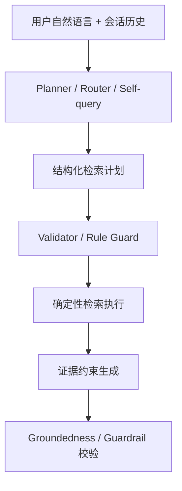

# Agentic RAG / LLM Planner 调研补充

日期：2026-05-31

用途：记录为什么我们从“规则解析 + hybrid retrieval”进一步调研 `LLM Planner / Agentic RAG`，调研到了哪些主流/经典脉络，以及这些结果如何辅助本项目后续设计。

## 触发问题

当前项目已经完成第一版约束感知 RAG：

```text
用户 query -> 规则 QueryIntent -> 硬过滤 -> keyword/facet/vector/graph 排序 -> 证据约束生成 -> guardrail
```

这条链路适合处理明确条件：

- 预算：200 元以内、预算降到 150。
- 类目：防晒、面霜、卸妆、T 恤。
- 排除：不要酒精、不要刺激、不要库存/优惠/下单承诺。
- 明确信息不足：我想买护肤品。

但 groundedness benchmark 暴露了一个更真实的问题：多轮用户表达不总是显式、完整、规则友好。

典型失败形态：

```text
第一轮：我是油皮，想要 200 元以内通勤防晒，不要酒精味太重。
第二轮：预算可以放宽到 300。
第三轮：那它有没有酒精？
第四轮：有没有更像刚才那个但便宜一点的？
```

这里需要系统同时理解：

1. “预算放宽到 300”是更新预算，不是取消预算。
2. “它”指向上一轮推荐或用户正在讨论的商品。
3. “更像刚才那个”要求继承商品属性，而不是重新开始搜索。
4. “不要酒精味太重”是排除/风险偏好，后续不能悄悄丢掉。

因此我们开始调研：是否应该在检索前引入 `LLM Planner`，让模型参与“检索意图构造”，而不是只在最后生成答案。

## 调研结论

最新趋势不是让 LLM 直接替代检索，而是让 LLM 参与生成可执行、可校验的检索计划。

可以概括为：



对本项目最重要的启发：

> LLM Planner 应该是“辅助理解层”，不是“自由裁判”。它可以帮助把口语、多轮、代词和隐含偏好翻译成结构化计划；但计划必须被 schema、规则和商品证据校验。

## 最新工作脉络

| 工作 / 框架 | 核心思想 | 对本项目的启发 | 是否直接采用 |
| --- | --- | --- | --- |
| AgenticRAG (2026) | 在企业知识库上给 LLM search/find/open/summarize 等工具，让模型迭代检索和分析证据 | RAG 不一定是一轮 top-k；可以让系统在证据不足时继续找、重查或细读 | 不直接接入；借鉴“工具式检索 + 证据导航” |
| Rethinking Agentic RAG (2026) | 让 LLM 生成 logical retrieval intent，由轻量检索接口严格执行 | 很贴合电商：自然语言最终应落到 price/category/exclude/product_id 等逻辑条件 | 不直接接入；作为 Planner 设计的主要理论依据 |
| A-RAG (2026) | 给模型 keyword_search、semantic_search、chunk_read 三类层级检索工具 | 可类比成 product_filter、semantic_product_search、product_detail_read | 不直接接入；参考其工具粒度和 agent loop |
| LangGraph Agentic RAG | 用 graph state + tool call + relevance grader + rewrite loop 管理检索流程 | 证明“检索、判断、改写、再检索”可以拆成可观察节点 | 不引入重框架；借鉴节点化与状态化 |
| LlamaIndex Agentic Strategies / Router | 用 routing、query transformation、query engine tools 做检索决策 | 适合多品类、多检索源：美妆/服饰/对比/详情事实问答可作为不同工具 | 暂不引入；借鉴 router / pydantic selector 思路 |
| LangChain SelfQueryRetriever | LLM 先生成 structured query / metadata filter，再交给 vector store | 正好对应“规则抽不全时让 LLM 补结构化 filter” | 不直接用；自研轻量 self-query 更可控 |
| Agentic RAG for Fintech (2025) | 用 query reformulator、sub-query generator、reranker、QA agent 处理专业领域缩写和碎片信息 | 和电商相似：领域字段多、术语多、需要专门 query reformulation 和评测集 | 不直接用；借鉴 modular agent + human-verified benchmark |

## 经典/高频前序工作

这些工作在多篇新论文和工程框架里反复出现，构成了这次调研的背景脉络。

| 方向 | 代表工作 | 经典原因 | 对本项目的保留方式 |
| --- | --- | --- | --- |
| 原始 RAG | Retrieval-Augmented Generation (2020) | 奠定“外部检索 + 生成”的基本范式 | 仍保留：商品库证据进入 prompt |
| Self-query / metadata filtering | LangChain SelfQueryRetriever 等 | 让 LLM 把自然语言转成结构化 filter | 作为 Planner 的直接参考：输出 JSON plan，而不是自然语言 |
| Query rewriting / query transformation | Multi-query、query rewrite、sub-question query engine | 解决用户问法短、跳跃、上下文缺失 | 用于多轮短追问：“它呢”“便宜点”“换一个” |
| Corrective RAG (CRAG) | 检索质量评估，不够好时纠正/重检索 | 认为很多幻觉其实是检索失败导致 | 后续可做 retrieval evaluator，而不是只靠生成 guardrail |
| Self-RAG | 模型学习何时检索、何时 critique | 把 retrieve/generate/critique 拆开 | 不训练模型；借鉴“生成前后都要自检”的流程 |
| GraphRAG / LightRAG | 用实体关系图增强检索 | 商品-品牌-类目-功效-风险天然适合图结构 | 已用轻量 graph relation score，不接重图数据库 |
| Router / Tool-use Agent | LlamaIndex Router、LangGraph tools | 让模型选择检索工具和路径 | 后续可把“商品搜索/商品详情/对比/追问”做成工具选择 |
| LLM-as-judge / synthetic eval | 多篇 domain RAG 论文使用 | 真实标注难时，用模型生成候选，再人工校验 | 已做 groundedness benchmark；后续可加入小规模 LLM judge |

## Rule-only 的前序依据

这里说的 `rule-only` 不是某一篇 RAG 论文里的完整算法名，而是把几个成熟工程模块先组合成低风险基线：

1. **电商 faceted search**：价格、品牌、类目、子类、尺码、材质等字段长期用确定性过滤处理。
2. **Self-query / metadata filtering**：LLM 或 parser 把自然语言变成结构化 filter，真正执行时仍交给数据库或向量库 metadata filter。
3. **Query parsing / query rewriting**：把“预算降到150”“先不看预算”“不要酒精刺激”转成机器可执行约束。
4. **Guardrail / validator**：预算、商品事实、排除条件这类不能错的边界，用规则做最后校验。
5. **Conversation state**：多轮系统里常见的状态合并规则，例如最新明确值覆盖旧值、没有显式取消时继承用户硬约束。

可以直接借鉴的不是具体词表，而是规则类型：

| 规则类型 | 可借鉴做法 | 本项目改造 |
| --- | --- | --- |
| 数值范围 | `price <= budget_max` 作为硬过滤 | `200元以内`、`预算降到150`、`放宽到300` |
| 类目/子类 | category / subcategory facet filter | 美妆护肤、服饰运动、防晒、眼霜、T恤、跑步鞋 |
| 排除条件 | deny-list / risk-term filter | 酒精、刺激、太油、拔干等，且后续默认继承 |
| 信息不足 | 不满足最低信息量时先追问 | “我想买护肤品”先问肤质/预算/功效 |
| 状态合并 | 最新明确约束覆盖旧约束 | 新预算覆盖旧预算；“先不看预算”才取消预算 |
| 输出校验 | 生成后检查是否越界 | 不编造价格、库存、优惠、下单承诺和无证据断言 |

必须本地改造的部分：

- 中文口语表达：例如“预算可以放宽到300”和“先放宽预算”语义不同，不能只看“放宽”两个字。
- 美妆领域风险：酒精、刺激、敏感肌、屏障不稳定等不是普通关键词，和商品证据绑定很紧。
- 小数据集边界：官方商品池只有有限商品，系统要能明确说“没有同时满足条件的商品”。
- 比赛可解释性：trace 要能说清楚哪些条件被继承、覆盖、取消，而不是只输出最终推荐。

因此，本项目采用的策略是：

```text
rule-only 负责不能错的显式边界
planner 只在规则低置信度、代词/抽象偏好/长多轮时补理解
validator 始终保留最后否决权
```

## 为什么不直接接入现成框架

目前不直接接入 LangGraph / LlamaIndex / A-RAG / LightRAG 的原因：

1. **项目已有主链路**：FastAPI、Chroma、RetrievalTrace、benchmark、Android SSE 都已经跑通，重接框架会引入迁移成本。
2. **比赛需要可解释**：自研轻量 planner 更容易在答辩里说明每一步如何解析、过滤、排序、兜底。
3. **数据规模很小**：当前 enriched 商品 30 条，没必要为了 30-100 条商品引入完整 agentic retrieval runtime。
4. **强约束更重要**：电商导购里预算、价格、排除条件、商品事实不能错；重框架不能替代本地 schema validator 和 guardrail。
5. **依赖风险**：比赛提交需要可复现，新增重依赖可能造成环境、版本和调试风险。
6. **我们只需要其中一小块**：当前主要缺口是多轮意图合并，不是开放域 multi-hop QA 的全套 agent loop。

因此更合理的路线是：

```text
借鉴 Agentic RAG / Self-query / Router 的思想
-> 自研轻量 Planner
-> 输出可校验 JSON
-> 仍由现有 hybrid retrieval 执行
```

## 对本项目的辅助方式

这次调研不是为了马上改代码，而是帮我们确定后续设计边界。

### 1. Planner 的位置

Planner 应该放在检索前：

```text
history + current_message
-> rule parser
-> optional LLM planner
-> plan validator
-> merged retrieval state
-> hybrid retrieval
```

不是放在生成后，也不是让它直接写答案。

### 2. Planner 的职责

Planner 可以做：

- 判断本轮是新搜索、继续筛选、商品事实追问、对比、重置还是闲聊。
- 解析抽象偏好，例如“别太猛”“有负担”“看起来精神”。
- 解析代词和指代，例如“它”“刚才那个”“第一款”。
- 把多轮短追问改写成完整检索问题。
- 提醒系统应保留哪些旧约束、覆盖哪些新约束。

Planner 不应该做：

- 生成最终推荐。
- 编造商品属性。
- 判断某商品一定“不含/不会刺激/适合所有人”。
- 自行新增不在商品库里的商品。
- 覆盖确定性硬规则。

### 3. Planner 输出形态

后续如果实现，建议不是自由文本，而是固定 JSON：

```json
{
  "turn_type": "product_followup",
  "rewrite_query": "用户想确认上一轮推荐商品是否有酒精相关风险",
  "budget_update": {
    "type": "set",
    "value": 300
  },
  "constraints_to_keep": ["skin_type", "exclude_terms", "use_case"],
  "constraints_to_drop": [],
  "referenced_product_policy": "previous_top_product",
  "target_attribute": "酒精",
  "needs_clarification": false
}
```

### 4. Validator 原则

Planner 输出必须经过校验：

| 校验项 | 规则 |
| --- | --- |
| 预算 | 必须是数字；规则解析到明确预算时，规则优先 |
| 商品引用 | 只能引用 history 里真实出现过的商品卡 |
| 排除条件 | 不能无理由丢弃用户前文明确排除项 |
| 类目/子类 | 必须在 schema 枚举或已知词典内 |
| 商品事实 | Planner 不能新增“含/不含/有效/不过敏”等事实 |
| 失败处理 | JSON 不合法或低置信度时，退回 rule-only |

## 和当前实现的关系

当前实现已经具备 Planner 的落地点：

| 当前能力 | 后续 Planner 可接入点 |
| --- | --- |
| `ChatRequest.history` | 可提供多轮消息和上一轮 assistant 文本 |
| `_message_for_retrieval()` | 可替换为 `build_retrieval_state()` |
| `QueryIntent` | 可扩展为 `MergedIntent` 或 `RetrievalPlan` |
| `RetrievalTrace` | 可新增 `planner_trace`、`state_before`、`state_after` |
| groundedness benchmark | 可用来对比 rule-only vs planner-assisted |
| generation guardrail | 保持作为最后防线 |

## 暂定实现路线

目前按三步推进：

### Step A：Rule-only State Merge

先把显式规则做扎实：

- 最新明确预算覆盖旧预算。
- “先不看预算”才取消预算。
- 排除条件默认继承。
- 当前会话内保存上一轮 top products。
- 代词追问先映射到上一轮商品。

2026-06-03 已完成第一版：

- 新增 `server/app/conversation_state.py`。
- `POST /api/debug/retrieve` 返回 `conversation_state` trace。
- 支持预算更新、预算取消、排除条件继承、类目/肤质/功效/场景合并。
- 新增 `CQ-05` 5轮 conversation case，conversation benchmark 从 4/4 扩展为 5/5 PASS。
- 同步复跑 golden、subcategory、apparel、comparison 和 generation guardrail，均通过。

仍未覆盖：

- “它 / 刚才那款 / 第一款”这类商品卡指代。
- 上一轮 top products 的结构化保存。
- 抽象偏好和复杂长对话的低置信度 planner fallback。

### Step B：Planner-assisted Fallback

只在规则吃力时调用 LLM Planner：

- 有代词但无明确商品。
- 多轮超过 3 轮。
- 用户表达抽象偏好。
- benchmark 失败 case。
- 规则解析低信心。

### Step C：Planner Benchmark

用同一套 case 对比：

```text
rule-only retrieval
vs
rule + planner retrieval
```

评估指标：

- 多轮 state 是否正确继承。
- 是否减少错误追问。
- 是否减少错商品召回。
- 是否引入新的幻觉或过度推断。
- 延迟是否可接受。

## 当前结论

1. 单靠确定性规则不足以覆盖真实多轮表达。
2. 最新 Agentic RAG / logical retrieval / self-query 工作支持“LLM 参与检索计划”的方向。
3. 但 LLM Planner 不应直接生成答案，也不应越过硬规则。
4. 本项目短期最合适的是自研轻量 Planner，而不是接入完整 agentic RAG 框架。
5. rule-only state merge 第一版已经完成；下一步应用 groundedness benchmark 找出哪些 case 真正需要 Planner。

一句话：

> 我们不是把 RAG 交给 Agent，而是让 Agent 帮 RAG 写一份可校验的检索计划。

## 参考资料

- AgenticRAG: Agentic Retrieval for Enterprise Knowledge Bases: https://arxiv.org/abs/2605.05538
- Rethinking Agentic RAG: Toward LLM-Driven Logical Retrieval Beyond Embeddings: https://arxiv.org/abs/2605.27123
- A-RAG: Scaling Agentic Retrieval-Augmented Generation via Hierarchical Retrieval Interfaces: https://arxiv.org/abs/2602.03442
- A-RAG GitHub: https://github.com/Ayanami0730/arag
- Agentic RAG for Fintech: Agentic Design and Evaluation: https://arxiv.org/abs/2510.25518
- LangGraph Agentic RAG: https://docs.langchain.com/oss/python/langgraph/agentic-rag
- LangGraph Memory Overview: https://docs.langchain.com/oss/javascript/concepts/memory
- LlamaIndex Agentic Strategies: https://developers.llamaindex.ai/python/framework/optimizing/agentic_strategies/agentic_strategies/
- LlamaIndex Routers: https://developers.llamaindex.ai/python/framework/module_guides/querying/router/
- LlamaIndex Structured Planning Agent: https://docs.llamaindex.ai/en/v0.12.15/examples/agent/structured_planner/
- LangChain SelfQueryRetriever: https://reference.langchain.com/python/langchain-classic/retrievers/self_query/base/SelfQueryRetriever
- Corrective RAG: https://arxiv.org/abs/2401.15884
- Self-RAG: https://arxiv.org/abs/2310.11511
- LightRAG: https://github.com/HKUDS/LightRAG
