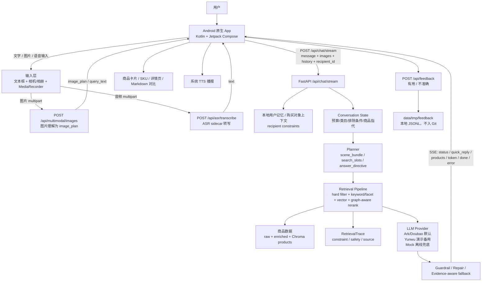
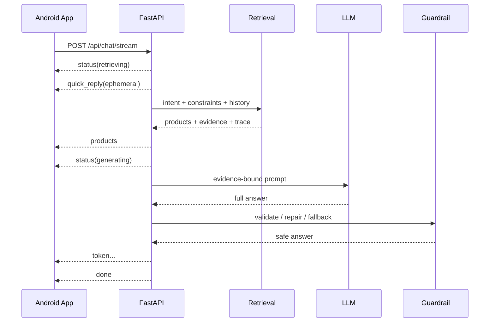
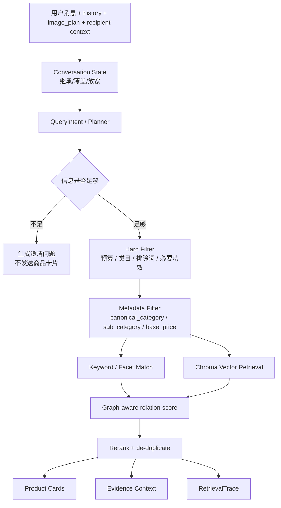

# RAG 智能导购 Agent 系统设计文档

建议飞书标题：RAG 智能导购 Agent 系统设计文档

本文面向评委和技术复盘，说明项目的系统架构、核心链路、接口契约、RAG 检索、Prompt/Planner、反幻觉防线、移动端交互和当前边界。本文可直接复制到飞书；截图占位需要在最终 Demo 复验后手动替换。

## 1. 项目背景与问题定义

电商导购场景的难点不是让模型说出一段“像导购”的话，而是让推荐结果能回到商品库证据，并且在价格、优惠、库存、功效、敏感肌、孕期/过敏等高风险信息上保持边界。普通聊天机器人容易把商品事实、模型常识和营销话术混在一起，导致推荐理由无法复验，甚至编造不存在的商品、价格或优惠。

本项目将目标限定为一个可运行、可演示、可解释的 RAG 智能导购闭环：用户在原生 Android App 中输入文字、图片或语音需求；FastAPI 后端把需求转为结构化约束和检索 query；RAG 检索从本地商品库召回候选商品；OpenAI-compatible LLM 只基于候选商品证据生成导购回复；后端 guardrail 在返回前拦截高风险幻觉；客户端用 SSE 流式展示回答、商品卡片和详情页。

当前版本主打的是“约束感知检索 + 商品证据约束生成 + 可复验反幻觉防线”。不承诺真实库存、优惠、下单、支付、全品类深度导购或 Google Lens 式图搜图。图片输入、ASR 语音输入和 TTS 播报已经接入代码，但最终提交视频中是否主展示，取决于提交前设备、provider 和 sidecar 的实测稳定性。

## 2. 总体系统架构



系统边界清晰分层：

| 层级 | 主要职责 | 关键文件 |
| --- | --- | --- |
| Android 客户端 | 输入、SSE 消费、流式渲染、商品卡片、详情页、图片/语音/TTS/反馈 | `client/android/app/src/main/java/com/saki/bytedance/ragshopping/` |
| API 层 | FastAPI 路由、SSE 协议、health、图片/ASR/feedback/user-memory 接口 | `server/app/main.py`、`server/app/asr_routes.py` |
| 状态与 Planner | 多轮约束继承、购买对象上下文、场景组合规划、对比指令 | `server/app/conversation_state.py`、`server/app/planner.py`、`server/app/user_memory.py` |
| RAG 检索 | QueryIntent、硬过滤、metadata filter、向量召回、rerank、trace | `server/app/retrieval.py`、`server/app/embeddings.py` |
| 生成与安全 | OpenAI-compatible LLM、Prompt、repair prompt、guardrail、fallback | `server/app/llm.py`、`server/app/guardrails.py` |
| 数据与评测 | raw/enriched 商品、Chroma 索引、benchmark、claim audit | `data/`、`scripts/`、`docs/11_evaluation_report.md` |

## 3. 技术栈与依赖环境

| 模块 | 技术选型 | 说明 |
| --- | --- | --- |
| Android | Kotlin、Jetpack Compose、OkHttp、Kotlin Coroutine | 原生 App，不是 H5；OkHttp 消费 SSE 和上传 multipart |
| 后端 | Python、FastAPI、Pydantic、Uvicorn | 提供流式聊天、调试、反馈、ASR、多模态图片接口 |
| 向量库 | ChromaDB | 本地 `products` collection，索引产物可重建，不提交 Git |
| Embedding | sentence-transformers | 用于商品语义召回 |
| LLM | Ark/Doubao OpenAI-compatible 默认；Yunwu 可作演示备用 | 通过 `.env` 切换 provider；mock 只用于离线结构验证 |
| 图片理解 | OpenAI-compatible VLM 或同 provider 多模态模型 | 输出 text-first `image_plan`，不做图像向量搜同款 |
| ASR | FastAPI 代理到本地 ASR sidecar | Android 录音上传，sidecar 返回转写文本 |
| TTS | Android 系统 TextToSpeech | 端侧播报助手回复，依赖设备中文语音能力 |
| 文档与评测 | Markdown、Mermaid、JSONL、Python scripts | 支撑复现、报告渲染和答辩证据 |

核心依赖文件：

- Python 依赖：`server/requirements.txt`
- Android 依赖：`client/android/app/build.gradle.kts`
- 配置模板：`.env.example`
- 复现说明：`docs/20_reproducibility_and_dependencies.md`

## 4. 目录结构

```text
client/android/   Android Kotlin + Jetpack Compose 客户端
server/           FastAPI 后端服务
data/raw/         官方原始商品数据和图片
data/enriched/    结构化增强商品数据
data/eval/        golden query、多轮、groundedness、claim audit 样例
data/indexes/     本地 Chroma 索引产物，忽略不提交
data/tmp/         trace、feedback、ASR、用户上传临时文件，忽略不提交
docs/             架构、API、评测、复现、提交材料
scripts/          数据检查、增强、索引构建、评测、安全扫描、报告渲染
demo/             本地录屏素材，忽略不提交
```

设计原则：

1. raw 数据不直接修改，保证官方数据可回溯。
2. enriched 数据承载检索字段、展示字段和证据来源。
3. 索引、trace、feedback、用户上传图片和录音都属于可再生或本地运行产物，不进入 Git。
4. README 保持入口导航；提交用设计文档和说明文档单独成篇，便于飞书提交。

## 5. 前后端接口设计

### 5.1 Health

`GET /health` 用于确认后端可用、商品库加载、当前 LLM provider 和 mock 状态。录屏前建议先展示该接口，但不要展示真实 API Key。

关键字段：

| 字段 | 含义 |
| --- | --- |
| `status` | 后端服务状态 |
| `catalog_size` | 当前加载商品数量 |
| `mock_llm` | 是否为 mock 生成 |
| `llm_provider` | 当前 provider，例如 `ark` 或 `yunwu` |
| `llm_model` | 当前模型名或 endpoint |

### 5.2 流式聊天

`POST /api/chat/stream` 是主接口。Android 提交用户输入、历史消息、可选图片引用和购买对象上下文；后端返回 SSE 事件。

请求字段：

| 字段 | 类型 | 说明 |
| --- | --- | --- |
| `message` | string | 本轮用户文本；图片-only 时允许为空 |
| `images` | array | 可选图片引用，来自 `/api/multimodal/images` |
| `user_id` | string | 本地用户 ID，用于 local memory |
| `recipient_id` | string | 当前购买对象，如自己、家人、同事 |
| `conversation_id` | string | 本地会话 ID |
| `history` | array | 最近对话；assistant 消息可带 `product_ids` 用于指代解析 |

SSE 事件：

| 事件 | 作用 | 是否用户可见 |
| --- | --- | --- |
| `status` | 检索/生成阶段状态 | 可显示为状态 |
| `quick_reply` | 首屏临时气泡，接住需求，不输出最终结论 | 可见但不写入下一轮 history |
| `products` | 本轮商品卡片 | 可见 |
| `token` | 正式回答文本片段 | 可见 |
| `done` | 结束 | 不直接展示 |
| `error` | 可恢复错误 | 可展示友好提示 |

常规推荐链路：



### 5.3 图片输入

`POST /api/multimodal/images` 接收 Android 相机或相册上传的 JPEG/PNG，返回 `image_id`、预览地址、`summary`、`query_text` 和 `image_plan`。后续聊天请求把该图片引用放入 `images`，后端会把 `image_plan` 转成检索线索并拼入当前 message。

当前实现是 text-first 图片理解：

1. 多模态模型从图片中抽取可见品类、品牌、包装文字、视觉属性、使用场景和置信度。
2. 生成 `query_text`，例如“图片识别线索：防晒、SPF50+、白色软管包装”。
3. 复用现有文本 RAG 检索链路，返回商品卡片。

明确边界：这不是图像 embedding 搜同款，不承诺识别任意真实商品，不承诺图片里的价格/库存/优惠准确。

### 5.4 ASR 与 TTS

`POST /api/asr/transcribe` 接收 Android 录音文件，将请求代理给本地 ASR sidecar，并返回转写文本。Android 将转写结果填入输入框或直接发送聊天请求。

TTS 不走后端接口，由 Android 系统 TextToSpeech 播报助手回复。它提升移动端可访问性和演示完整度，但依赖设备上的中文 TTS 引擎。

### 5.5 用户反馈与购买对象

`POST /api/feedback` 记录 `有用` / `不准确` 反馈和有限上下文快照，写入 `data/tmp/feedback/`，用于后续把失败 query 沉淀成 benchmark。

购买对象接口：

- `GET /api/user-memory/{user_id}/recipients`
- `PUT /api/user-memory/{user_id}/recipients`
- `PUT /api/user-memory/{user_id}/selected-recipient`

这些接口用于维护“给谁买”的轻量上下文，如肤质、尺码、避开项、收货备注等。提交主讲建议把它作为个性化补充，不作为核心亮点。

## 6. RAG 链路设计

当前 RAG 不是“纯向量检索”，而是约束优先的混合检索。预算、明确排除条件和必要功效属于硬约束，不能交给模型自由判断；Chroma 向量召回用于补充语义匹配，而不是替代结构化过滤。



检索核心要点：

| 设计点 | 做法 | 评分价值 |
| --- | --- | --- |
| 信息不足先追问 | 泛泛说“想买护肤品”时不强行推荐 | 减少乱推和幻觉 |
| 预算硬过滤 | `budget_max` 直接过滤候选 | 防止价格越界 |
| 子类/功效过滤 | 防晒、修护、洁面、眼霜等进入 facet | 提升检索准确率 |
| 排除约束继承 | “不要酒精/刺激”等进入 state 和 prompt | 支撑多轮可靠性 |
| Chroma 向量召回 | 语义召回补充 keyword 漏召 | 提升复杂表达覆盖 |
| graph-aware score | 类目、子类、预算、偏好关系给小权重 | 解释结构化匹配 |
| RetrievalTrace | 记录过滤、召回、排序、证据来源 | 答辩可复验 |

## 7. Prompt 构造与 Planner

后端使用 Planner 把复杂需求拆成可执行结构。对于简单单品推荐，Planner 输出普通检索意图；对于“三亚度假从防晒到穿搭的一套方案”这类场景化需求，Planner 可输出 `recommendation_mode=scene_bundle` 和多个 `search_slots`，由检索层跨类目执行。

Planner 负责：

1. 判断是否需要澄清。
2. 抽取预算、品类、场景、功效、排除项。
3. 对场景化组合生成 search slots。
4. 对商品比较生成 answer directive，避免模型自由编对比对象。

生成 Prompt 的约束：

1. 只解释候选商品，不新增商品。
2. 价格、品牌、规格、图片、详情来自商品卡片或 raw/enriched 数据。
3. 资料未说明时必须说“资料未说明/不能保证”，不能补全成确定承诺。
4. 不输出库存、优惠、满减、购买链接、下单承诺。
5. 对敏感肌、孕期、过敏等风险场景使用边界提醒。

后端当前选择“先聚合模型回答，再校验后重新以 SSE token 输出”，这是为了保证最终流给 Android 的内容已经过 guardrail 管理。它牺牲了一点首 token 的真实性能，但换来价格/优惠/库存等红线的可控性；首屏体感通过 `quick_reply` 临时气泡解决。

## 8. 商品数据与索引

数据分层如下：

| 层级 | 路径 | 内容 | 提交状态 |
| --- | --- | --- | --- |
| 官方 raw | `data/raw/ecommerce_agent_dataset/` | 商品 JSON、图片、RAG 文本 | 提交 |
| enriched deep | `data/enriched/beauty_products.jsonl`、服饰样例 | 肤质、功效、场景、卖点、注意事项、证据来源 | 提交 |
| thin support | `data/enriched/thin_products.jsonl` | 其余官方商品的基础检索字段 | 提交 |
| Chroma index | `data/indexes/chroma/` | 本地向量索引 | 不提交，可重建 |
| eval cases | `data/eval/` | golden、多轮、对比、groundedness、claim audit | 提交 |

索引构建命令见说明文档，核心脚本是 `scripts/build_index.py`。索引会把 enriched 商品写入统一 `products` collection，并将 `canonical_category`、`sub_category`、`base_price` 等字段保存为 metadata，支持检索阶段 metadata filter。

数据口径：系统底层使用官方 100 条商品作为统一商品库；美妆护肤是深度打磨主线，服饰运动有第二品类样例，其余品类提供资料内基础检索和边界说明。提交时不要承诺所有品类都达到美妆深度。

## 9. 商品卡片与详情页设计

Android 端的商品展示不是模型文本的一部分，而是后端返回的结构化 `products` 事件。商品卡片展示：

- 商品图
- 品牌
- 商品名
- 价格
- 标签
- 推荐理由
- SKU/variant 信息

点击卡片进入详情页，展示：

- 图片
- 价格、类目、子类
- 适合人群
- 使用场景
- 卖点
- 注意事项
- 商品描述和变体信息

截图占位：

> [截图 1：Android 首页 + 文字输入 + 流式回答]

> [截图 2：商品卡片列表]

> [截图 3：商品详情页]

设计边界：当前对比结果可用 Markdown 表格和多商品卡片表达，不新增复杂对比 UI；这是提交前避免 UI 风险的保守选择。

## 10. 加分项设计

最终建议主讲 3 个亮点。

### 10.1 证据约束 RAG 与反幻觉防线

普通导购 chatbot 容易编造商品、价格、优惠和功效。本项目把商品事实放在后端：商品卡片来自数据源，模型只看到候选商品和证据，生成后经过 guardrail、repair 和 evidence-aware fallback。

关键实现：

- `server/app/retrieval.py`：硬过滤、向量召回、metadata filter、trace。
- `server/app/llm.py`：Prompt、真实 provider 调用、repair、fallback。
- `server/app/guardrails.py`：价格、库存、优惠、下单、无证据绝对断言拦截。
- `data/eval/claim_audit_samples.json`：claim-level audit 样例。

Demo 展示：防晒推荐时说明卡片价格来自数据源；再展示一个资料不足或高风险边界回答，强调“不承诺零幻觉，而是有发现、拦截、修复和兜底的工程防线”。

### 10.2 场景化 Planner 与多轮对比决策

普通 RAG demo 往往只能回答单轮推荐。本项目通过 Planner 和 conversation state 支持多轮指代、反选、预算更新、类目切换和场景组合。复杂需求可以拆成 `search_slots`，检索层按结构化计划跨类目选品。

关键实现：

- `server/app/planner.py`
- `server/app/conversation_state.py`
- `docs/30_scene_bundle_planner_implementation.md`
- `data/eval/failure_regression_cases.json`

Demo 展示：先进行普通防晒推荐，再追问“第一款和第三款怎么选”或展示“三亚度假一套方案”，说明系统能把复杂场景拆到可检索结构。

### 10.3 原生移动端多模态与语音可访问体验

普通比赛 Demo 容易停留在 Web 聊天框。本项目是原生 Android App，已经接入图片输入、ASR 语音输入和 TTS 播报，能更接近真实移动导购体验。

关键实现：

- `server/app/asr_routes.py`：`/api/multimodal/images`、`/api/asr/transcribe`。
- `server/app/models.py`：`ChatImageRef`、`ChatRequest.images`。
- `client/android/.../ShoppingAgentClient.kt`：图片上传、ASR 上传、SSE 消费。
- `client/android/.../TtsSpeaker.kt`、`TtsSettings.kt`：TTS 播报和设置。

当前限制：图片是 text-first VLM/OCR 线索，不是图搜图；ASR 依赖 sidecar；TTS 依赖设备中文语音引擎。若最终设备不稳定，视频中只展示其中最稳的一项，文档中如实说明其余能力已接入但需环境验证。

## 11. 关键问题与解决方案

| 问题 | 风险 | 当前方案 |
| --- | --- | --- |
| 首屏等待慢 | 用户误以为无响应 | `quick_reply` 临时气泡先接住需求，主链路继续完整 Planner + RAG |
| 模型编价格/优惠 | 官方红线 | 商品卡来自数据源，guardrail 拦截未授权价格、优惠、库存、下单 |
| 泛需求乱推 | 推荐质量差 | 信息不足时澄清，不发送 `products` |
| 多轮历史污染 | 后续问题继承旧条件 | conversation state 区分继承、覆盖、放宽和自包含需求 |
| 商品指代错误 | “第一款/它”解析错 | assistant history 带回 `product_ids`，不让模型自由猜 |
| 图片识别不确定 | 错误线索污染检索 | `image_plan.confidence` 和 clarification question；低置信度保守追问 |
| ASR/TTS 环境差异 | 演示不稳定 | 语音能力作为可选演示，说明 sidecar 和设备依赖 |
| 索引不可提交 | 评委无法复现 | 文档写清 `build_index.py`，索引放 `data/indexes/` 且可重建 |

## 12. 防幻觉与可靠性

本项目不承诺“模型永远不会幻觉”。提交时应使用更准确的口径：

> 在高风险商品事实场景里，系统能把事实来源限制在本地商品库，并通过检索约束、Prompt、生成后 guardrail、repair/fallback、trace 和 claim audit 样例来发现、拦截和修复常见幻觉。

可靠性证据分四层：

| 层级 | 验收问题 | 证据 |
| --- | --- | --- |
| 检索层 | 是否把不满足预算/类目/排除条件的商品送入候选 | golden queries、conversation cases、metadata filter、RetrievalTrace |
| 生成层 | 是否限制模型只解释候选商品 | evidence-bound prompt、candidate cards |
| Guardrail | 是否拦截价格/优惠/库存/下单/无证据绝对断言 | `server/app/guardrails.py`、guardrail scripts |
| Audit | 是否能逐条复盘高风险事实主张 | `data/eval/claim_audit_samples.json`、`scripts/render_claim_audit_report.py` |

claim-level audit 截图占位：

> [截图 4：claim audit Markdown/JSONL 报告]

## 13. 工程实现与错误处理

工程质量设计包括：

1. API 契约稳定：SSE 事件类型固定，客户端和后端按事件解耦。
2. mock/fallback 分层：mock 只用于离线结构验证；真实 provider 失败时后端返回安全兜底，避免 App 卡死。
3. 本地运行产物隔离：trace、feedback、index、上传文件和录屏均被 `.gitignore` 覆盖。
4. 配置脱敏：真实 API Key 只放本地 `.env`，提交 `.env.example`。
5. 评测脚本可复跑：检索、对话、对比、groundedness、feedback、claim audit 均有脚本入口。
6. 运行 trace 不记录 API Key，只记录 provider、是否配置 key/model、mock 状态和阶段耗时。

后端 health 截图占位：

> [截图 5：`/health` 返回 mock_llm=false、provider/model 正确]

## 14. 局限与未来工作

当前明确不做或不主讲：

1. 真实交易链路：购物车、下单、支付、库存、实时优惠。
2. 完整图搜图：当前图片是 text-first 线索，不是图像向量检索。
3. 全品类同等深度：美妆是深度主线，服饰是第二品类样例，其余品类 thin support。
4. 完整自动化 claim-level judge 平台：当前是高风险样例和报告脚本。
5. 重型 GraphRAG/Neo4j：当前是轻量 graph-aware relation score。

未来可以增强：

- 增加真实用户反馈到 benchmark 的自动转化。
- 扩大 claim-level audit 的覆盖范围。
- 为图片输入加入图像 embedding 或商品包装识别 benchmark。
- 为 ASR/TTS 增加设备兼容性测试和降级 UI。
- 在服饰、数码、食品等品类继续补 deep enriched 数据。

## 15. 飞书迁移检查

复制到飞书后需要人工检查：

1. Mermaid 图是否正常渲染；如果不支持，导出为图片后插入。
2. 5 个截图占位是否替换为最终 Demo 截图。
3. GitHub 仓库、说明文档、演示视频链接权限是否为评委可访问。
4. 环境变量示例中没有真实 Key、手机号、地址或本地隐私路径。
5. “已实现/需验证/未来工作”的措辞没有混淆。
